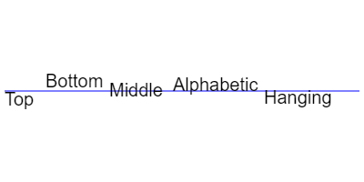

# [HTML](./index.md) | 03 canvas标签<!-- omit in toc -->

🌸Author [**Echo Pan**](https://github.com/echopan)

- [1. 简介](#1-简介)
- [2. 应用领域](#2-应用领域)
- [3. 格式](#3-格式)
- [4. 渲染上下文（The rendering context）](#4-渲染上下文the-rendering-context)
- [5. 绘制模板](#5-绘制模板)
- [6. 形状与路径](#6-形状与路径)
  - [6.1. 绘制矩形](#61-绘制矩形)
  - [6.2. 绘制路径](#62-绘制路径)
    - [6.2.1. beginPath()](#621-beginpath)
    - [6.2.2. closePath()](#622-closepath)
    - [6.2.3. `stroke()`](#623-stroke)
    - [6.2.4. `fill()`](#624-fill)
    - [6.2.5. `moveTo(x,y)`](#625-movetoxy)
    - [6.2.6. `lineTo(x,y)`](#626-linetoxy)
  - [6.3. 绘制三角形](#63-绘制三角形)
  - [6.4. 圆弧 arc](#64-圆弧-arc)
  - [6.5. 贝塞尔曲线 Bezier](#65-贝塞尔曲线-bezier)
- [7. 颜色与样式](#7-颜色与样式)
  - [7.1. 纯色](#71-纯色)
    - [7.1.1. 填充样式`fillStyle`](#711-填充样式fillstyle)
    - [7.1.2. 描边样式`strokeStyle`](#712-描边样式strokestyle)
    - [7.1.3. 透明度](#713-透明度)
  - [7.2. 线型样式 Line Style](#72-线型样式-line-style)
    - [7.2.1. `lineWidth` 线条宽度](#721-linewidth-线条宽度)
    - [7.2.2. `lineCap` 线条末端样式](#722-linecap-线条末端样式)
    - [7.2.3. `lineJoin` 线条与线条接合处样式](#723-linejoin-线条与线条接合处样式)
  - [7.3. 渐变 Gradients](#73-渐变-gradients)
    - [7.3.1. 线性渐变](#731-线性渐变)
    - [7.3.2. 径向渐变](#732-径向渐变)
  - [7.4. 虚线 Line Dash](#74-虚线-line-dash)
  - [7.5. 图案 Pattern](#75-图案-pattern)
  - [7.6. 阴影 Shadows](#76-阴影-shadows)
  - [7.7. 填充规则 fill](#77-填充规则-fill)
- [8. 绘制文本](#8-绘制文本)
  - [8.1. 填充文本 `fillText`](#81-填充文本-filltext)
  - [8.2. 文本描边 `strokeText`](#82-文本描边-stroketext)
  - [8.3. 测量宽度 `measureText`](#83-测量宽度-measuretext)
- [9. 使用图像 Using Image](#9-使用图像-using-image)
  - [9.1. 引入图像](#91-引入图像)
  - [9.2. 绘制图像 drawImage()](#92-绘制图像-drawimage)
    - [9.2.1. 简单绘制](#921-简单绘制)
    - [9.2.2. 缩放 Scaling](#922-缩放-scaling)
    - [9.2.3. 裁切 Slicing](#923-裁切-slicing)

***

## ✨Echo有话说<!-- omit in toc -->

[_Canvas教程_](https://developer.mozilla.org/zh-CN/docs/Web/API/Canvas_API/Tutorial)

备忘：`proto`

## 1. 简介

`canvas`是`HTML5`提供的用于展示绘图效果的标签。

`canvas`是一个矩形画布，可以用`JS`绘图，它本身没有画图功能。

## 2. 应用领域

- **游戏**
- **数据可视化**  
  包括百度的`Echarts`、`d3.js`、`three.js`、`higncharts`
- **banner 广告**（横幅广告）
- **模拟器，图形编辑器**

## 3. 格式

`canvas`默认大小为 300px * 150px，可以自定义大小：

```html
<canvas width="600" height="400"></canvas>
```

注意，`canvas`可以用CSS来定义大小，区别是html中设置的是画布，而css中设置的是框架，绘图时图片会伸缩来适应该框架大小。而且当css尺寸比例和画布不一样时，图像就会扭曲拉伸。

## 4. 渲染上下文（The rendering context）

`<canvas>`起初是空白的，它公开了一个或多个渲染上下文用来绘制和处理展示的内容，我们的教学基于2D渲染上下文，其他当然还有`WebGL`使用了基于`OpenGL ES`的3D上下文。

脚本要先找到上下文才能绘制，`canvas`提供一个`getContext()`方法，用来获取渲染上下文和绘图功能。`getContext()`可以接受一个参数，即上下文类型。对于2D图像而言，可以使用`CanvasRenderingContext2D`接口，获取方法：

```js
var canvas = document.getElementById('tutorial');
var ctx = canvas.getContext('2d');
```

## 5. 绘制模板

```html
<!DOCTYPE html>
<html>
  <head>
    <title>Canvas tutorial</title>
    <script type="text/javascript">
      function draw(){
        var canvas = document.getElementById('tutorial');
        if (canvas.getContext){
          var ctx = canvas.getContext('2d');
        }
      }
    </script>
    <style type="text/css">
      canvas { border: 1px solid black; }
    </style>
  </head>
  <body onload="draw();">
    <canvas id="tutorial" width="150" height="150"></canvas>
  </body>
</html>
```

说明：写的`script`代码可以放在`body`尾部，这样加载网页时会自动加载；也可以放在`head`或其他任意位置，这样就需要给功能代码套一个函数`function`，然后在`html`标签中使用`onload="函数"`或在`script`中用`window.onload=函数`调用。

## 6. 形状与路径

`canvas`支持绘制矩形和路径。

### 6.1. 绘制矩形

```js
fillRect(x,y,width,height);//填充矩形
strokeRect(x,y,width,height);//矩形边框
clearRect(x,y,width,height);//清除矩形区域（透明），橡皮擦功能
```

这三个函数使用后会自动绘制，与后面的路径函数（Path function）有所区别。

如果使用的是`rect()`函数的话，则需要手动设置`fill`还是`stroke`。

### 6.2. 绘制路径

步骤：

1. 创建路径起点
2. 使用画图命令
3. 关闭路径
4. 描边或填充路径

#### 6.2.1. beginPath()

新建一条路径，将图形绘制命令指向该路径。在绘制路径的时候，会有一个路径列表记录子路径，即一个`beginPath()`下的所有路径。而当重新开始一个`beginPath()`时，会清空之前保存的记录，无论是否`stroke()`或者`fill()`。

[使用Canvas绘制图形](https://developer.mozilla.org/zh-CN/docs/Web/API/Canvas_API/Tutorial/Drawing_shapes)

***

#### 6.2.2. closePath()

闭合路径，将图形绘制命令重新指向上下文。不是必需的。

该命令会尝试连接当前点和起始点，使图形闭合，如果已经是闭合图形或只有一个点则不作操作。但是该命令不会重建一条新路径，它与`beginPath()`没有关系。

当调用`fill()`时，未闭合形状自动闭合，但是`stroke()`不会。

**注意，beginPath和closePath不是必须的。**

[_canvas里的beginPath和closePath_](https://blog.csdn.net/weixin_34124651/article/details/89009953?spm=1001.2101.3001.6650.2&utm_medium=distribute.pc_relevant.none-task-blog-2%7Edefault%7EOPENSEARCH%7Edefault-2.fixedcolumn&depth_1-utm_source=distribute.pc_relevant.none-task-blog-2%7Edefault%7EOPENSEARCH%7Edefault-2.fixedcolumn)&emsp;[_理解beginPath和closePath_](https://blog.csdn.net/qq_33448537/article/details/61698180)

***

#### 6.2.3. `stroke()`

通过线条绘制图形轮廓,将路径列表中的子路径全部绘出。

#### 6.2.4. `fill()`

通过填充路径内容生成实心的图形。

#### 6.2.5. `moveTo(x,y)`

移动画笔到指定的x和y坐标上，设置路径起点。

#### 6.2.6. `lineTo(x,y)`

绘制直线，从当前位置到x和y坐标上。

### 6.3. 绘制三角形

```js
  // 填充三角形
  ctx.beginPath();
  ctx.moveTo(25, 25);
  ctx.lineTo(105, 25);
  ctx.lineTo(25, 105);
  ctx.fill();

  // 描边三角形
  ctx.beginPath();
  ctx.moveTo(125, 125);
  ctx.lineTo(125, 45);
  ctx.lineTo(45, 125);
  ctx.closePath();
  ctx.stroke();
```

### 6.4. 圆弧 arc

使用`arc()`方法绘制圆或圆弧。

语法：

```js
arc(x, y, radius, startAngle, endAngle <, anticlockwise>);
//x,y:确定圆心位置
//radius:半径长度
//startAngle:起点，按x轴方向算，单位弧度
//endAngle:终点
//anticlockwise:可选，true逆时针，false默认顺时针
```

因为采用弧度制，所以表达的时候可以这么写`Math.PI*2`。

简单画个圆：

```js
var canvas = document.getElementById("canvas");
var ctx = canvas.getContext("2d");

ctx.beginPath();//开始路径
ctx.arc(75, 75, 50, 0, 2 * Math.PI);//圆
ctx.stroke();//绘制路径
```

如果要绘制扇形，可以使用两种方法，一种是`moveTo`到圆心，然后绘制圆弧，最后闭合路径；另一种方法是先画圆弧，然后`lineTo`到圆心，最后闭合路径。

### 6.5. 贝塞尔曲线 Bezier

使用贝塞尔曲线绘制路径。语法：

```js
//确定起始点
moveTo(x,y);
//二次贝塞尔曲线，第一个坐标为控制点，第二个坐标为结束点
quadraticCurveTo(cp1x, cp1y, x, y);
//三次贝塞尔曲线，依次为控制点1，控制点2，结束点
bezierCurveTo(cp1x, cp1y, cp2x, cp2y, x, y);
```


[_MDN - 绘制圆弧_](https://developer.mozilla.org/zh-CN/docs/Web/API/Canvas_API/Tutorial/Drawing_shapes#圆弧)&emsp;[_圆和弧度_](http://c.biancheng.net/ref/62.html)&emsp;[_贝塞尔曲线_](https://blog.csdn.net/weixin_42513339/article/details/83019610)

## 7. 颜色与样式

### 7.1. 纯色

#### 7.1.1. 填充样式`fillStyle`

修改填充颜色。语法：

```js
// 这些 fillStyle 的值均为 '橙色'
ctx.fillStyle = "orange";
ctx.fillStyle = "#FFA500";
ctx.fillStyle = "rgb(255,165,0)";
ctx.fillStyle = "rgba(255,165,0,1)";
```

#### 7.1.2. 描边样式`strokeStyle`

修改描边颜色，用法与`fillStyle`类似。

#### 7.1.3. 透明度

可以通过`globalAlpha`或者`rgba`来设置透明度。

### 7.2. 线型样式 Line Style

#### 7.2.1. `lineWidth` 线条宽度

注意当线条宽度没有完全占据像素格子时，带来的模糊渲染问题。

#### 7.2.2. `lineCap` 线条末端样式

线段末端样式，包括三种：

1. `butt`，末端平齐，默认
2. `round` 末端是为1/2线宽的半圆
3. `square` 末端是高度为1/2线宽的方块

#### 7.2.3. `lineJoin` 线条与线条接合处样式

线段连接处样式，拿折线举例：

1. `miter` 连接处向外延伸（尖角），默认
2. `round` 磨圆连接处（圆角），圆半径等于线宽
3. `bevel` 平角

### 7.3. 渐变 Gradients

#### 7.3.1. 线性渐变

```js
//起点和终点，表示一条线段,类似于PS里的渐变工具
var lg=ctx.createLinearGradient(x1,y1,x2,y2);
```

y1 和 y2 决定了渐变存在的范围  
x1 和 x2 决定了渐变的方向

首先设置颜色样式，并把该颜色设置为当前颜色：

```js
//addColorStop(position, color);
//position介于0.0-1.0，颜色相对位置
lg.addColorStop(0,"white");//在起始位置为白色
lg.addColorStop(0.5,"black");//在中间位置为黑色

ctx.fillStyle=lg;
```

注意，设置的颜色位置相对于画布是固定的，当画上图形的时候，与图形重叠部分的该颜色会显示出来。实际上，这里的画图仅相当于解除透明的作用，真正的图形是设置的颜色。

```js
//绘出图形，图形所在区域会显示设置的渐变色
ctx.fillRect(50,50,50,50);
```

实际使用中存在的问题：设置的是两个坐标点，不是长宽；没有理解x和y实际决定了什么，x是方向，y是范围。

#### 7.3.2. 径向渐变

```js
//圆1：原点+半径，圆2：原点+半径
var rg=ctx.createRadialGradient(x1, y1, r1, x2, y2, r2);

//举例
var rg=ctx.createRadialGradient(75,75,10,75,75,50);
rg.addColorStop(0,"pink");//0是圆1边缘
rg.addColorStop(0.8,"purple")//0-1之间的参数为过渡
rg.addColorStop(1,"yellow");//1是圆2边缘

ctx.fillStyle=rg;//将样式改为rg
ctx.fillRect(0,0,150,150);//显示设置的样式
```

### 7.4. 虚线 Line Dash

`setLineDash`定制虚线样式：

```js
//指定线段与间隙,奇数位线段，偶数位间隙
ctx.setLineDash([4,2,10,6]);
```

`lineDashOffest`设置起始偏移量，默认为0。

### 7.5. 图案 Pattern

```js
var ptrn=ctx.createPattern(image, type);
//image可以是image对象或者另一个canvas对象
//Type的值包括repeat，repeat-x，repeat-y，no-repeat

//例子
var img = new Image();
img.src = 'someimage.png';
var ptrn = ctx.createPattern(img,'repeat');
ctx.fillStyle = ptrn;
ctx.fillRect(0, 0, 150, 150);
```

### 7.6. 阴影 Shadows

- `shadowOffsetX` x轴偏移
- `shadowOffsetY` y轴偏移
- `shadowBlur` 模糊度
- `shadowColor` 阴影颜色

```js
ctx.shadowOffsetX = 2;
ctx.shadowOffsetY = 2;
ctx.shadowBlur = 2;
ctx.shadowColor = "rgba(0, 0, 0, 0.5)";
```

### 7.7. 填充规则 fill

- `ctx.fill("nonzero")` 默认值，完全填充
- `ctx.fill("evenodd")` 重叠部分透明

## 8. 绘制文本

通过`ctx.font=""`设置字体样式，和在css中设置类似。

其他的属性设置还包括：

- `textAlign` 值包括`start`,`end`,`left`,`right`,`center`
- `textBaseline` 值包括`alphabetic`,`top`,,`haning`,`bottom`,`middle`等
- `direction` 值包括`ltr`,`rtl`,`inherit`



### 8.1. 填充文本 `fillText`

```js
fillText(text,x,y[,maxWidth]);

//例子
ctx.font = "48px serif";
ctx.fillText("Hello world", 10, 50);
```

### 8.2. 文本描边 `strokeText`

```js
strokeText(text,x,y[,maxWidth]);
```

### 8.3. 测量宽度 `measureText`

```js
var measureText=ctx.measureText('文本内容');//获取测量对象
var width=measureText.width;//获取宽度属性
```

关于第一次测出的宽度和第二次不一致的问题，是因为宽度是根据字体大小来计算的，需要把`measureText`放到`font`后面。

[_绘制文本_](https://developer.mozilla.org/zh-CN/docs/Web/API/Canvas_API/Tutorial/Drawing_text)&emsp;[_测量宽度_](https://www.cnblogs.com/xiaoxuStudy/p/12229819.html)&emsp;[_measureText_](https://developer.mozilla.org/zh-CN/docs/Web/API/CanvasRenderingContext2D/measureText)

## 9. 使用图像 Using Image

### 9.1. 引入图像

图片源可以是：

- 任意`Image()`函数构造对象或``元素
- `<video>`元素中的一帧
- 另一个`<canvas>`元素

[举例](https://www.html5canvastutorials.com/tutorials/html5-canvas-images/)：

```js
var img=new Image();//创建image对象，用于加载图像缓存

img.onload=function(){
    context.drawImage(img,69,50);
};
img.src="image url";
```

### 9.2. 绘制图像 drawImage()

#### 9.2.1. 简单绘制

```js
drawImage(image,x,y);
//x，y是起始坐标
```

#### 9.2.2. 缩放 Scaling

```js
drawImage(image,x,y，width，height);
//width和height为缩放大小
```

#### 9.2.3. 裁切 Slicing

```js
drawImage(image,sx,sy，sWidth，sHeight,dx,dy,dWidth,dHight);
//dx和dy是必须参数，绘制起始坐标
//dw和wh是绘制宽高，允许缩放图像
//sx和sy是裁切起始点（相对源而言）
//sw和sh是裁切宽高
```

绘制流程：前四个参数先对源图像进行裁切，然后通过后四个参数把裁切后的图像绘制在画布上，也就是说，**裁切参数是相对图像源而言的，绘制参数是相对画布而言的，缩放针对的是裁切后的新图**。

***
[上一章：02.栅格系统](./02.栅格系统.md)  

[下一章：04.canvas标签2](./04.canvas标签2.md)  

[返回目录](./index.md)